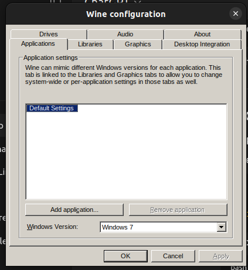

```{=html}
<style>

#DataTables_Table_0_wrapper {
  background-color: #ffffff !important;
  color: #000000 !important;

}

</style>
```

## What is Line? Why is installing it on Linux complicated?

Line is a free messaging software similiar to products such as Whatsapp, Facebook Messenger or Signal. It is commonly used in Taiwan and therefore I receive a lot of messages on it. I would like to be able to run it on my ubuntu desktop computer. Unfortunately, line has not made a version of their software for linux, only windows, Mac, Android and IOS.

They also have a chrome browser extension that works on linux which I have been using as a workaround. Unfortunately I received a message when I started up the extension that Line will be discontinuing their Chrome extension around September 2025. (I forget the exact date and can't find any copy of the announcement online).

## What is this blog post about?

This blog post will document the workarounds I try to get Line working on my Ubuntu Desktop.

## Disclaimers

I've decided to publish this blog post continuously throughout the process instead of waiting until I have a solution to publish. Consequently, the post will change quite a bit as I try different things and dead ends. Until I reach a solution and a final version of the post is published, this post will be incomplete, may have typos and may not work. I will edit the blog post after I've figured out something that works, but even then the solution I find may not work on your linux distro, personal computer, etc. I hope this post helps others, but I can't guarantee that it will help in every individual case.

## First step: Evaluate options

As I see it there is basically only one option with different flavors: get a Line version for Windows, Mac, Android or Ios running on my computer. Once I pick which operating system I want to try to emulate or run on Linux I need to evaluate which method of emulation or direct running of the foreign OS works best. For example, Windows version of Line could be run inside of Wine or inside of a virtual machine.

Here are the things I want to look for in order of importance:

1.  Do no harm - I want to minimize the risk of messing up something else on my computer in the process
2.  Reliability - I want the line app to consistently run with constantly crashing or losing features
3.  Minimal Overhead - I want a solution that doesn't use a ton of RAM or CPU
4.  Ease of setup - I want this to be as easy as possible to get running

## Step 2: Ask ChatGPT

Just to see what would would happen I asked ChatGPT the following and then provided the text from the start of this blog post:

```         
I want to find a way to get the line messaging app running on ubuntu desktop. Read the following blog post and do your own research, then give me some recommendations for how to run line on ubuntu given the priorities outlined in the blog post.
```

ChatGPT recommended a few options for install the windows version of Line on Ubuntu including Wine, a virtual machine, or a third party messaging app with a line integration. I asked a follow up about using an android emulator and it said that would be more complicated and buggy.

## Steo 3: Install Wine

As part of its response ChatGPT asked me if I'd like a guide to installing Wine, so I said yes. Here's a summary of each step I tried and what happened afterward. Here's a link to the [full chat](https://chatgpt.com/share/68a55f1d-06f4-8008-ab4f-c2060bd7bd6a) I had with ChatGPT.

Unless otherwise noted, all of the following code was run in the linux terminal.

The first step, which is good practice before installing anything on Linux, was to update other packages by running the following:

``` bash
sudo apt update
```

Then I installed Wine and some other dependencies:

``` bash
sudo apt install wine64 wine32 winetricks
```

Then I checked my version of Wine:

``` bash
wine --version
```

Here's the version information for the copy of Wine that I'm running

```         
wine-6.0.3 (Ubuntu 6.0.3~repack-1)
```

ChatGPT told me that I should expect version 8 or higher, but then I googled online and found this [discussion](https://forums.linuxmint.com/viewtopic.php?t=412524) which suggested that version 6 is the expected highest version for Ubuntu 22. I'm running ubuntu version 22 so I'll ignore ChatGPT for now about not having Wine version 8.

Here's more details about the Ubuntu version I'm running:

``` bash
lsb_release -a
```

```         
No LSB modules are available.
Distributor ID: Ubuntu
Description:    Ubuntu 22.04.5 LTS
Release:    22.04
```

After I ran that step I encountered something ChatGPT didn't tell me about. A Wine Dialog box popped up and asked me to choose a version of Windows to emulate.



I decided to try Windows 10 first, so I selected Windows 10 from the dropdown menu and clicked apply and okay. The dialog box then closed.

The next step ChatGPT suggested was to visit Line's official website and download the version for Windows. Unfortunately, ChatGPT didn't realize that line's website detects your browser's operating system and doesn't give a windows download option for users on linux. Fortunately, I have a windows laptop, so I visited the official line site using it and the right clicked the windows download button then copied the link to the windows download page.\
\
This \[link\](<https://desktop.line-scdn.net/win/new/LineInst.exe>) should always link to the newest version of the windows app, but if not you could repeat the same process I used on a Windows computer to get the new link.

I then tried to install the Line executable using Wine and almost immediately weird things started happening. Here's the command I ran

``` bash
```

I tried clicking cancel to load the debugger

I also tried installing new version

But I just got more errors

At this point I forced quit line using the system monitor and closed the terminal I had been working on.

At this point I returned to ChatGPT, provided the error messages and screenshots of the error windows. Chat GPT recommended installing some additional dependencies so I tried that.

After installing the recommended dependencies I got different error. A blank dialog box popped up.

When I clicked the only button in the box, the two windows closed and the entire installation stopped. I returned to ChatGPT again and tried uploading the screenshots again to see what further steps it suggested, but unfortunately at that point ChatGPT told me I had reached the max number of messages. ( Here's another problem I see coming with AI, it's eventually going to become expensive. I predict OpenAI is only going to put up with losing money for so long and will eventually force free users into paid subscriptions by progressively limiting the amount you can do with the free version. Uber used to be cheap too before they captured the market and started raising prices....)

Anyways, I logged out of my ChatGPT acount and sent the following prompt to the logged out free version of ChatGPT

```         
I'm trying to install line on ubuntu using wine, why after trying to run the windows installer  does the dialog box not have text and then the installation fails


WINEPREFIX=~/wine-line wine ~/Downloads/LineInst.exe
```

After running the following

``` bash
WINEPREFIX=~/wine-line winetricks corefonts
```

I got this dialog box


<hr>

## 
